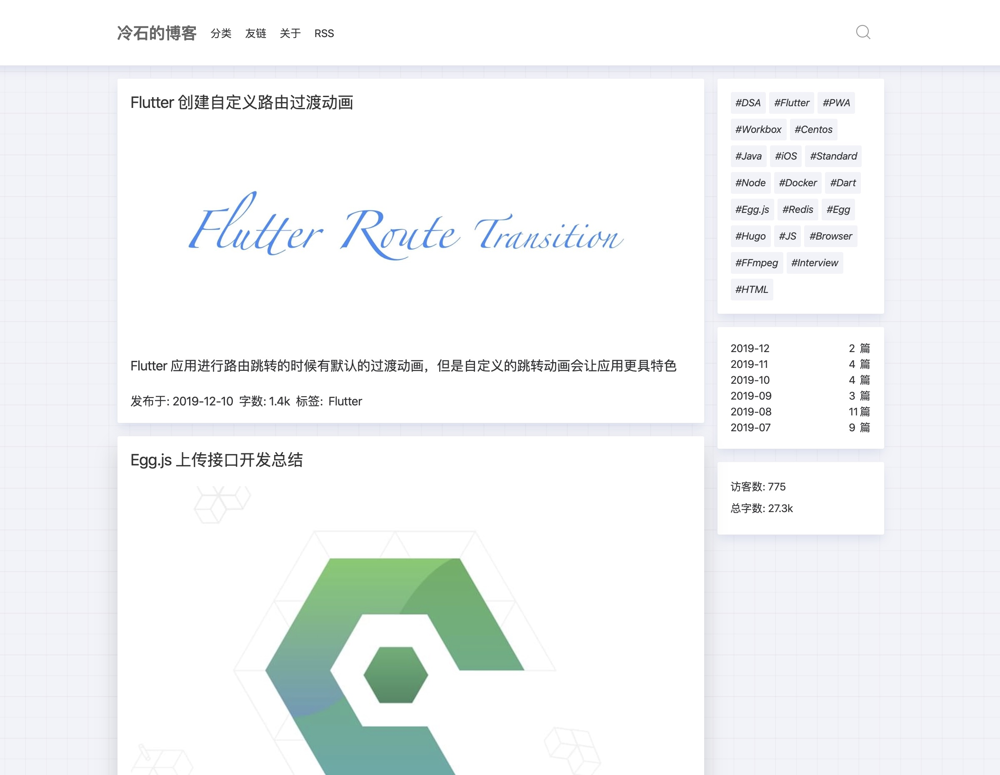
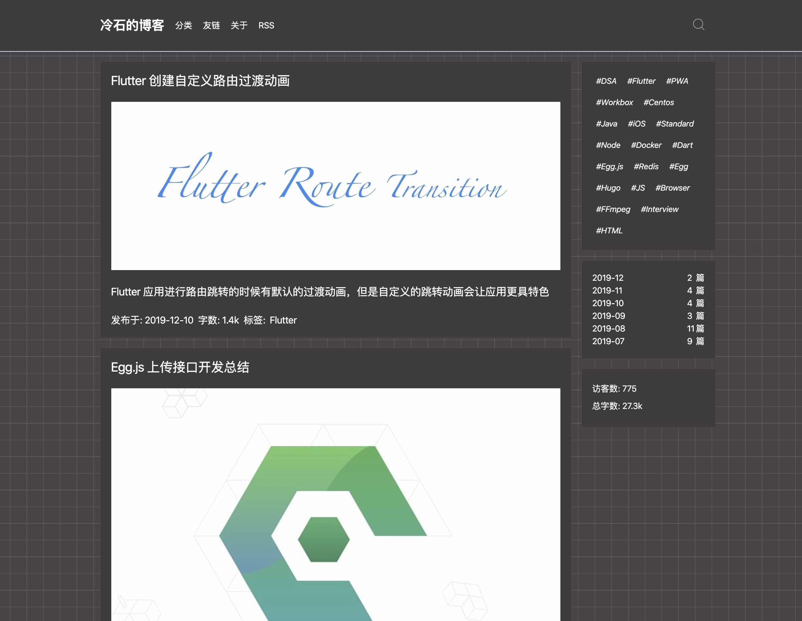
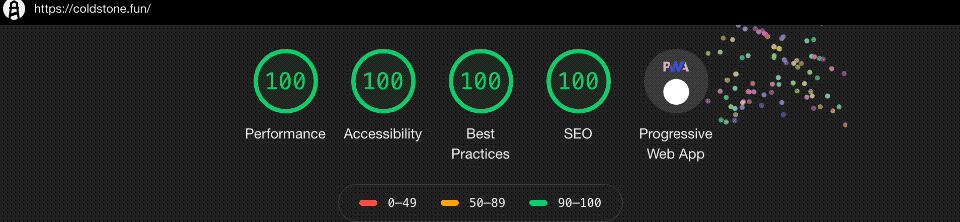

# Cold Stone :tada:

簡潔、シンプル、文字を主体とした [Hexo](https://hexo.io/zh-cn) ブログのテーマ

## プレビュー

light


dark


[サンプルサイト](https://coldstone.fun)

## 特徴

- 自動的にダークモードへの切り替え
- PWA（rogressive Web Apps）
- [Utteranc](https://utteranc.es/) コメント対応
- モバイルデバイスフレンドリー
- English/中文/日本語

## クイックスタート

まずは [Hexo](https://hexo.io) をインストールしてプロジェクトを作成します。既にインストール済みならこのトピックをスキップしてください。

```sh
npm install -g hexo-cli

hexo init <folder>

cd <folder>

npm install
```

### テーマのインストール

```sh
git clone https://github.com/dongsu-iis/hexo-theme-cold-stone.git themes/cold-stone --depth 1
```

### 使い方

1. Hexo プロジェクトフォルダ配下の `_config.yml` ファイルを修正し、theme は変更する

```yml
theme: cold-stone
```

2. `themes/cold-stone` フォルダ配下の `icons` フォルダを `source` フォルダの中へ移動する

3. プロジェクトの親フォルダにて下記のコマンドを実行し、新しいページを作成する

```sh
hexo new page projects

hexo new page categories

hexo new page tags

hexo new page about
```

`source/projects/index.md` ファイルに以下のコードを追加します

```md
---
layout: projects
---
```

`source/categories/index.md` ファイルに以下のコードを追加します

```md
---
layout: categories
---
```

`source/tags/index.md` ファイルに以下のコードを追加します

```md
---
layout: tags
---
```

4. 以下のように Hexo ブログの設定情報を修正する `_congfig.yml`

```yml
# ブログ情報
seo_title: 冷石的博客
project_dir: projects

# ユーザーアイコン
avatar: avatar.png

# Utteranc コメント欄
comment:
  repo: xrr2016/blog

# SNS
sns:
  github: xrr2016
  juejin: 576666b7207703006b1e0f09
  twitter: xrr2016

# 訪問数の取得（GoogleTagManagerのIdが必要）
track:
  gaid: xxxxxxxxxxxxxx
```

5. `source` フォルダ配下に `avatar.png` 画像を追加

6. hexo-wordcount (文字数カウント)をインストール

```sh
npm i --save hexo-wordcount
```

7. hexo-all-minifier (ブログコードを圧縮する)をインストール

```sh
npm i --save hexo-all-minifier
```

### RSS

hexo-generator-feed をインストール（rss リンクを生成）

```sh
npm i --save hexo-generator-feed
```

`_congfig.yml` で rss を true に設定します

```yml
# RSS
rss: true
feed:
  type: atom
  path: atom.xml
  limit: 20
  hub:
  content:
  content_limit: 140
  content_limit_delim: ' '
  order_by: -date
  icon: avatar.png
  autodiscovery: true
```

### ローカル環境にて実行

```sh
hexo server
```

### デプロイ

hexo-deployer-git をインストール

```sh
 npm install hexo-deployer-git --save
```

設定情報を修正

```yml
deploy:
  type: git
  repo: https://github.com/your-username/your-repo
  branch: gh-pages
```

デプロイ command

```sh
hexo clean && hexo deploy
```

他のデプロイ方法参考サイト：https://hexo.io/docs/deployment

## 導入実績

[冷石的博客](https://coldstone.fun) 💯



## TODOS

- [x] 検索機能

- [x] ページング機能

- [x] ページの訪問数の表示

- [x] フレンドリーリンクのページ

## 変更履歴

v2019-10-10

- ブログのトラフィック統計を追加する
- 記事のフォント統計の表示位置を変更しました
- 表示するブログ投稿の数を追加しました
- Safari での表示エラー報告を修正 [issue8](https://github.com/xrr2016/hexo-theme-cold-stone/issues/8)

v2019-10-08

- 日本語のインターフェースとドキュメントを追加、@ [dongsu-iis](https://github.com/dongsu-iis) に感謝
- コードの強調表示を修正＃[issue](https://github.com/xrr2016/hexo-theme-cold-stone/issues/7)、hexo に付属するコードの強調表示を無効にする必要があります
- [hexo-all-minifier](https://github.com/chenzhutian/hexo-all-minifier#readme) を追加して、ブログコードを圧縮し、ブログをより速く開きます。
- 記事に前/次のリンクを追加
- 記事ラベルスタイル、記事内のリンクスタイルを更新 v

v2019-09-30

- ナビゲーションバーのレイアウトを修正
- メインページのロード動画時間を増やした
- ブラウザー設定に沿ってダークモードに切り替えできるように修正

v2019-09-25

- メインページのロード動画を追加
- テーマの幅を少し縮小

v2019-09-23

- PC 側のトップページレイアウト修正
- 文字数計算機能 (hexo-wordcount のインストールが必要)
- PC 側では Google 検索機能を追加
- フレンドリーリンクページの新規作成

## ライセンス

[MIT](LICENSE)

もしこのテーマが良いと思ったら、このリポジトリーに star をください 😎
