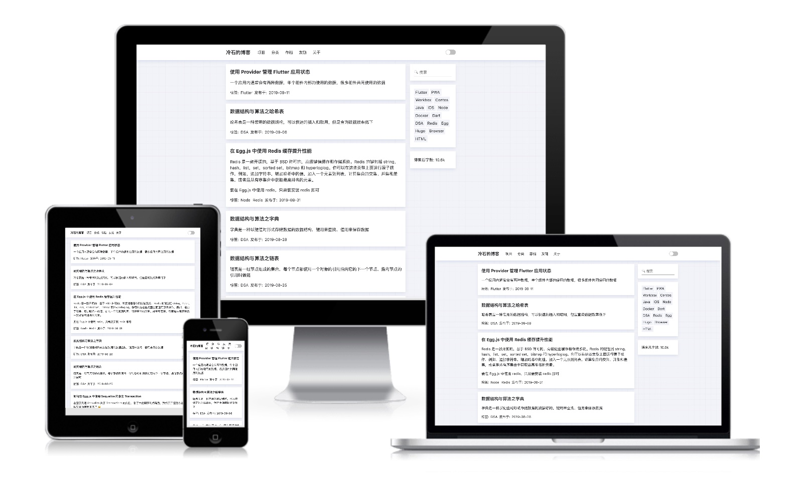

# Cold Stone :tada:

一个简洁，文字为主的 [Hexo](https://hexo.io/zh-cn) 博客主题

## 前言

个人认为博客的主要内容应该是文字，但是很多 Hexo 主题带有大量的图片，容易分散读者的注意力，而一些以文字为主的主题功能都有些简陋，因此 Cold Stone 主题诞生了！

## 预览



[链接](https://coldstone.fun)

## 特性

- 夜间模式
- PWA（渐进式应用）
- [Utteranc](https://utteranc.es/) 评论系统
- 移动端友好
- English/中文

## 快速开始

首先需要安装 [Hexo](https://hexo.io) 用来创建项目，已经初始过的可以跳过此步

```sh
npm install -g hexo-cli

hexo init <folder>

cd <folder>

npm install
```

### 安装主题

```sh
git clone https://github.com/xrr2016/hexo-theme-cold-stone.git themes/cold-stone
```

### 使用

1. 修改你的 Hexo 博客根目录下 `_config.yml` 文件 theme 设置为

```yml
theme: cold-stone
```

2. 将 `themes/cold-stone` 目录下的 `icons` 移动到 `source` 目录下

3. 在项目根目录执行以下命令，新建需要的页面

```sh
hexo new page projects

hexo new page categories

hexo new page tags

hexo new page about
```

添加 `source/projects/index.md` 的 layout 配置为

```md
---
layout: projects
---
```

添加 `source/categories/index.md` 的 layout 配置为

```md
---
layout: categories
---
```

添加 `source/tags/index.md` 的 layout 配置为

```md
---
layout: tags
---
```

4. 修改你的 Hexo 博客的配置 `_congfig.yml`，示例如下

```yml
# 博客设置
seo_title: 冷石的博客
project_dir: projects

# 用户设置
avatar: avatar.png

# Utteranc 评论系统
comment:
  repo: xrr2016/blog

# 社交平台链接：
sns:
  github: xrr2016
  juejin: 576666b7207703006b1e0f09

# 博客访问数据
track:
  gaid: xxxxxxxxxxxxxx
```

5. 在 `source` 目录下添加 `avatar.png` 图片

### 本地运行

```sh
hexo server
```

### 发布

安装 hexo-deployer-git

```sh
 npm install hexo-deployer-git --save
```

修改配置

```yml
deploy:
  type: git
  repo: https://github.com/your-username/your-repo
  branch: gh-pages
```

发布

```sh
hexo clean && hexo deploy
```

更多方式参考：https://hexo.io/docs/deployment

## 谁在使用

[冷石的博客](https://coldstone.fun) 💯


# TODOS

- [ ] 搜索功能

- [x] 分类页面

- [x] 显示页面访问量

- [ ] 友站链接页面

## 协议

[MIT](LICENSE)

如果觉得这个主题不错，请个这个仓库一个 star 吧
